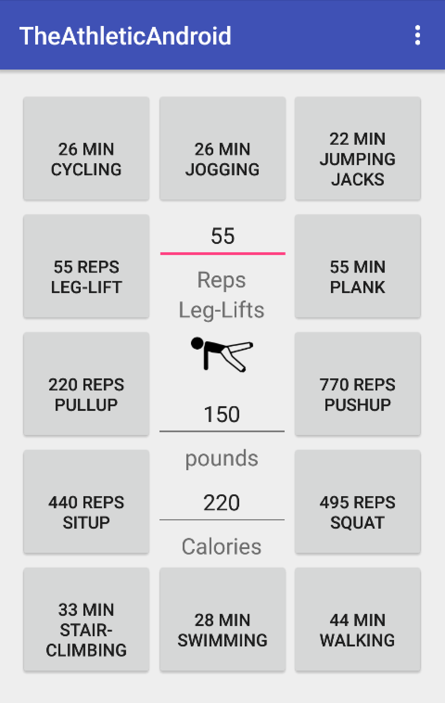
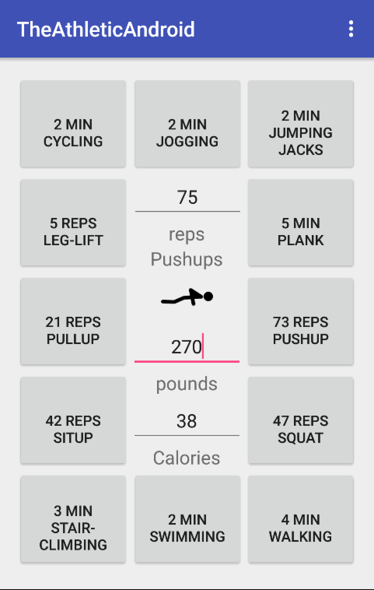
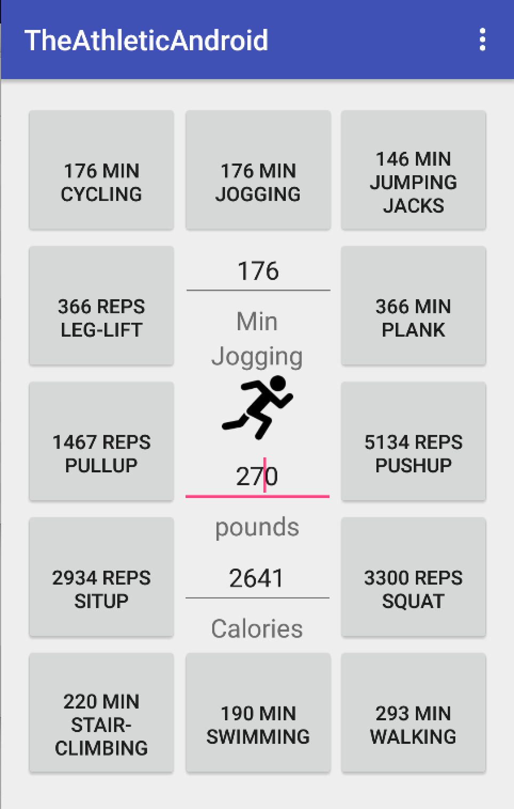
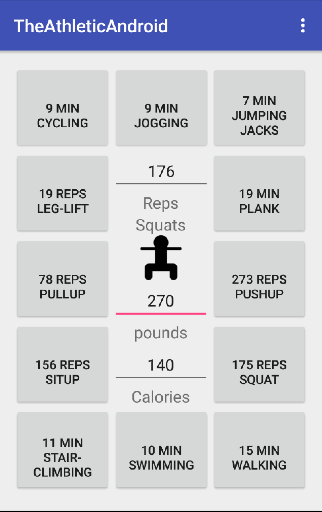

# PROG 01: Crunch Time

The Athletic Android

The app has only one screen which displays all the information. The button create a border around a smaller box with the valuable data. This serves to focus the users experience to a smaller region populated with dense information based on their request. The majority of users will want to know how many calories were burned for one exercise, so after the initial workout selection, they will only interact with a small region of the screen in the middle.

The app was built so the order of action doesn’t matter and the correct result will be displayed regardless of how they approach using the app.

Here is the steps of a standard user:

1. Launch Android App
2. Select your workout from the buttons around the outside
	- UPDATES: icon for workout in the middle to confirm your decision
	- UPDATES: activity name under reps or mins
	- UPDATES: where the exercise is measured in minutes or reps to display only on
3. Input how many reps or mins were accomplished
	- UPDATES: Calories burned for a default weight (150lb) user
	- UPDATES: All surrounding buttons/workouts to display how many reps or min are required to burn the same amount of calories
4. Input how much the user weighs
	- UPDATES: Calories burned
5. Input calories burned
	- UPDATES: Reps or mins for current workout to burn this amount of calories
	- UPDATES: All surrounding buttons/workouts to display how many reps or min are required to burn this amount of calories at this weight

The app works to remove ambiguity of whether a workout is measured in min or reps by constantly displaying the information for each workout.

## Authors

Marcus Smith ([m.smith@berkeley.edu](mailto:m.smith@berkeley.edu))

## Demo Video

See [The Athletic Android] (https://youtu.be/IJaXAElpKkM)

## Screenshots

## Acknowledgments

* Hat tip to anyone who's code was used
* Any other support

*Feel free to enhance your README. For Markdown syntax, see [the GitHub Guides](https://guides.github.com/features/mastering-markdown/). Remove this line in your submission.*
